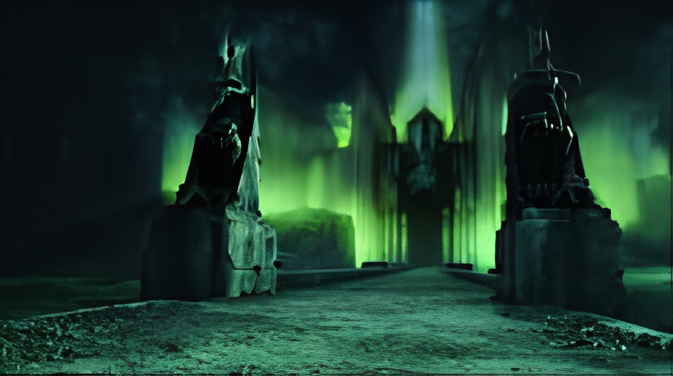

# 🏰 Minas Morgul Government
> *The Shadow’s Dominion - Official Website of the Dark Realm*  

  

## 📜 Deskripsi Proyek  
**Minas Morgul Government** adalah website profil fiktif yang menggambarkan sistem pemerintahan di Minas Morgul, benteng kegelapan yang dipimpin oleh **Witch-King of Angmar**.  

Website ini dirancang dengan desain modern namun tetap mempertahankan nuansa misterius dan mengancam, selaras dengan atmosfer Minas Morgul di dunia **The Lord of the Rings**.  

Website ini mencakup informasi tentang sejarah, kebijakan, pasukan, serta pencapaian dari pemerintahan Minas Morgul.  

---

## 🌑 Fitur Utama  
✅ **Dark Theme Design**: Tampilan serba hitam dan hijau neon khas Minas Morgul.  
✅ **Hero Section**: Pengenalan singkat tentang dominasi kegelapan.  
✅ **Interactive Sections**: Sejarah, militer, dan pencapaian pemerintahan.  
✅ **Animated Effects**: Efek kabut, transisi smooth, dan hover animation.  
✅ **Responsive Design**: Bisa diakses di berbagai perangkat.  

---

## 🔧 Teknologi yang Digunakan  
- **HTML5** - Struktur utama website  
- **CSS3 (Tailwind CSS)** - Styling modern dan responsif  
- **JavaScript** - Animasi dan interaksi sederhana  
- **Font Awesome** - Ikon-ikon untuk mendukung tampilan  

---

## 🚀 Cara Menjalankan Proyek  
1️⃣ **Clone Repository**  
```bash
git clone https://github.com/FajarAntiHero/PROJECT_SASS_FJR_MM_GOVERNMENT
